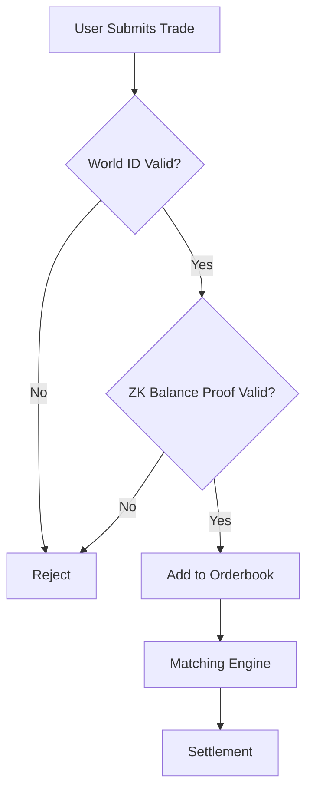

# 🚀 What You Can Do RIGHT NOW - March 6, 2026

## Quick Overview
You've sent your message to the team. While waiting for responses, here are **5 productive things** you can do immediately.

---

## ⚡ Quick Wins (5-10 minutes each)

### 1. Run CRE Workflow Simulation
```powershell
cd privotc-cre\my-workflow
cre workflow simulate . --target privotc-staging
```
**Why:** Validates your entire workflow is ready to deploy (no external dependencies needed)

### 2. Test All ZK Proof Scenarios
```powershell
.\test-all-zk-scenarios.ps1
```
**Why:** Automated testing of 4 different balance scenarios. Proves your ZK circuits work correctly.

### 3. Apply for CRE Early Access
**URL:** https://chain.link/cre  
**Time:** 5-10 minutes  
**Why:** Approval takes 1-2 weeks, so start now!

### 4. Check Your Implementation
```powershell
.\check-production-ready.ps1
```
**Why:** Identifies any missing pieces before deployment

### 5. Review Documentation
Read through:
- [TESTING_GUIDE.md](TESTING_GUIDE.md)
- [DEV3_STATUS.md](DEV3_STATUS.md)
- [README_PRIVOTC.md](privotc-cre/my-workflow/README_PRIVOTC.md)

**Why:** Ensure you can explain the system to your team

---

## 🎯 Deeper Tasks (30-60 minutes)

### A. Performance Benchmarking
Create a script to measure:
- ZK proof generation time
- Witness generation speed
- Verification speed

```powershell
# Create performance-test.ps1
Measure-Command { node generate_witness.js ... }
Measure-Command { npx snarkjs groth16 prove ... }
Measure-Command { npx snarkjs groth16 verify ... }
```

### B. Create Integration Test Data
Prepare realistic test scenarios for when contracts are deployed:

**File:** `test-data/realistic-trades.json`
```json
[
  {
    "trade_type": "buy",
    "token_in": "USDC",
    "token_out": "ETH",
    "amount_in": "10000",
    "price": "3500",
    "world_id_proof": "..."
  }
]
```

### C. Study Other Chainlink CRE Examples
**Research:** Look at public CRE workflows on GitHub for best practices:
- Error handling
- Logging strategies
- Configuration management
- Testing approaches

### D. Optimize Your Workflow Code
Review [privotc-cre/my-workflow/privotc-workflow.ts](privotc-cre/my-workflow/privotc-workflow.ts):
- Add more error handling
- Improve logging messages
- Add input validation
- Add comments for complex logic

---

## 🌟 Advanced Projects (1-2 hours)

### 1. Create a Local Testing Environment
Set up mock contracts for testing without waiting for Dev 1:

```typescript
// mock-contracts.ts
export const mockContracts = {
  OTC_SETTLEMENT: "0x0000000000000000000000000000000000000001",
  PROOF_VERIFIER: "0x0000000000000000000000000000000000000002",
  // ... etc
}
```

### 2. Build a CLI Testing Tool
```powershell
# cli-test-tool.ps1
param(
    [string]$action,
    [string]$inputFile
)

switch ($action) {
    "intake" { # Simulate trade intake }
    "match" { # Simulate matching }
    "settle" { # Simulate settlement }
}
```

### 3. Create Monitoring Dashboard (PowerShell)
```powershell
# monitor-workflow.ps1
while ($true) {
    Clear-Host
    Write-Host "📊 PrivOTC Workflow Status" -ForegroundColor Cyan
    
    # Check workflow status
    cre workflow list
    
    # Check recent logs
    cre workflow logs privotc-confidential-trading --tail 10
    
    Start-Sleep -Seconds 30
}
```

### 4. Write Unit Tests for Helper Functions
If you have any utility functions, write tests for them.

---

## 📝 Documentation Improvements

### Add to Your Portfolio
Create a blog post or presentation about:
- "Building Privacy-Preserving OTC Trading with ZK-SNARKs"
- "Integrating World ID with Chainlink CRE"
- "Zero-Knowledge Proofs in DeFi"

### Create Visual Diagrams
Use tools like:
- **Mermaid.js** - Flow diagrams
- **Excalidraw** - Architecture diagrams
- **Figma** - UI mockups

Example Mermaid diagram:


---

## 🎓 Learning Opportunities

### Deep Dive into Technologies
- **ZK-SNARKs:** Study the math behind Poseidon hash and Groth16
- **Confidential Compute:** Read about Intel SGX and TEEs
- **World ID:** Understand the World ID protocol
- **Chainlink CRE:** Read all documentation

### Follow Relevant Communities
- Chainlink Discord
- World ID Discord
- ZK-Hack community
- 0xPARC (ZK research)

---

## 🎯 Prioritized Action Plan

**High Priority (Do Today):**
1. ✅ Run `cre workflow simulate`
2. ✅ Run `test-all-zk-scenarios.ps1`
3. ✅ Apply for CRE Early Access

**Medium Priority (This Week):**
4. Create integration test data
5. Optimize workflow code
6. Write documentation improvements

**Low Priority (Nice to Have):**
7. Performance benchmarking
8. CLI testing tool
9. Portfolio blog post

---

## 💡 Key Insight

**You don't need to wait for anyone to make progress!**

Your ZK circuits and CRE workflows are self-contained. You can:
- Test everything locally
- Validate your implementation
- Prepare for integration
- Learn and improve

When Dev 1 provides contracts and Tenderly URLs, you'll just update config files and deploy. Everything else is already done! ✨

---

## 🆘 If You Get Stuck

**Issue: CRE simulation fails**
- Check logs in `.cre_build_tmp.js`
- Verify `privotc-config.json` is valid JSON
- Ensure all dependencies are installed

**Issue: ZK proof generation fails**
- Check input values are valid BigInt strings
- Verify witness file exists
- Re-run setup: `cd zk-circuits && npm run setup`

**Issue: World ID validation fails in tests**
- Use mock data for local testing
- Real validation only works with live World ID app

---

**Start Now:** Open PowerShell and run `.\test-all-zk-scenarios.ps1` ⚡
