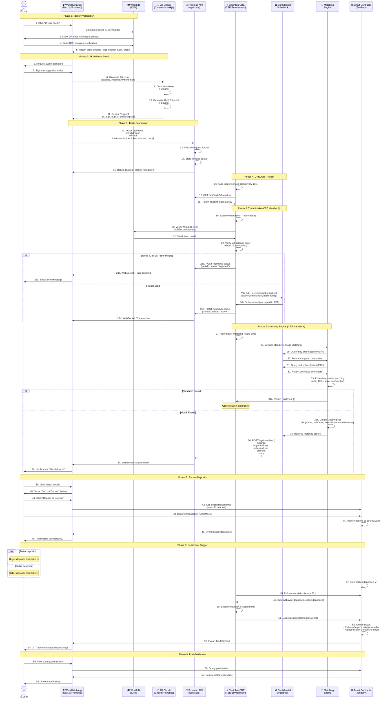
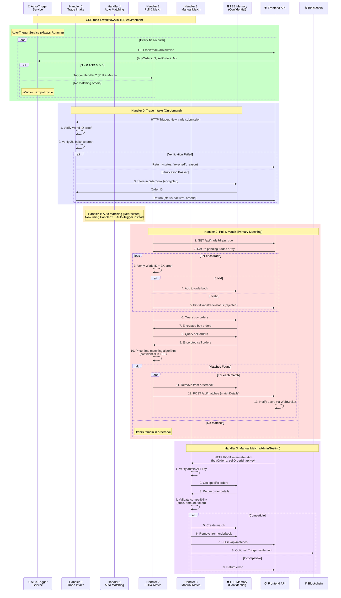
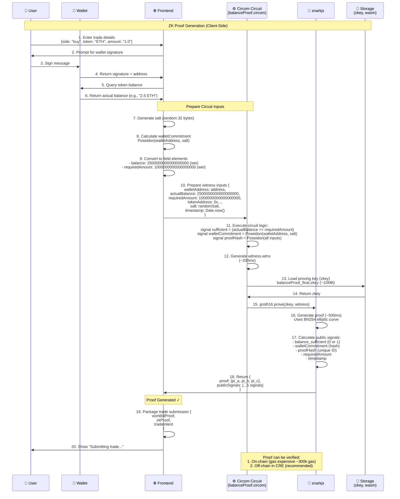
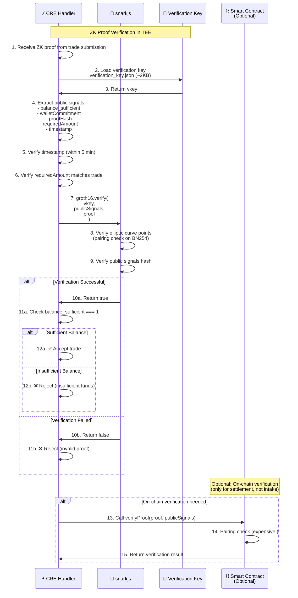
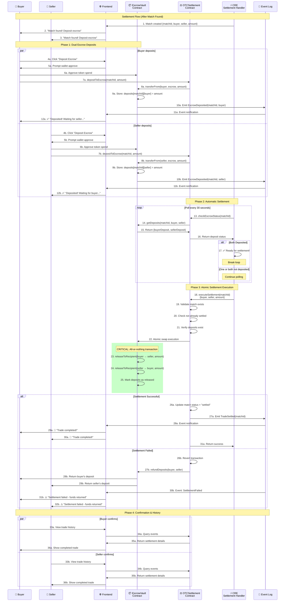
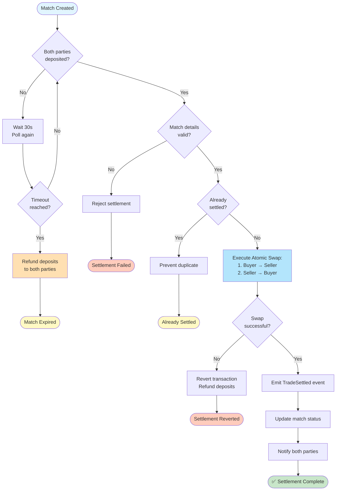
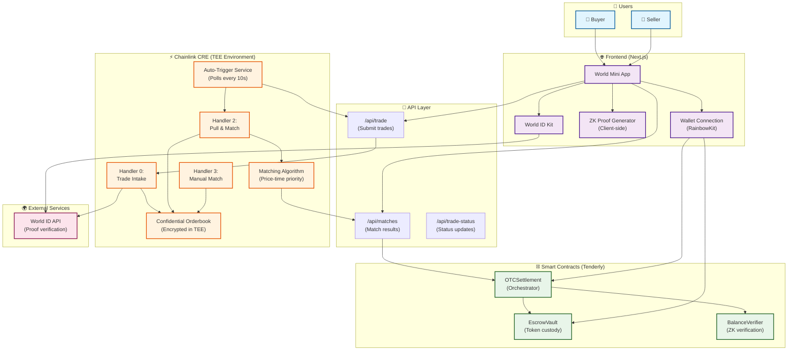
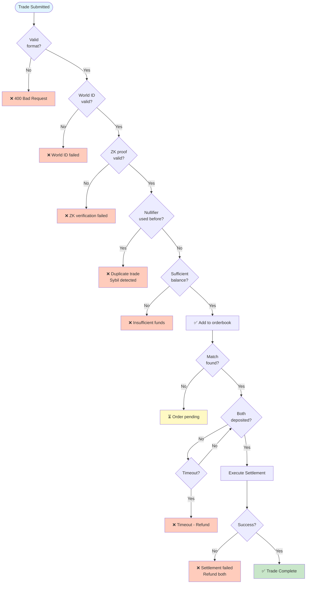
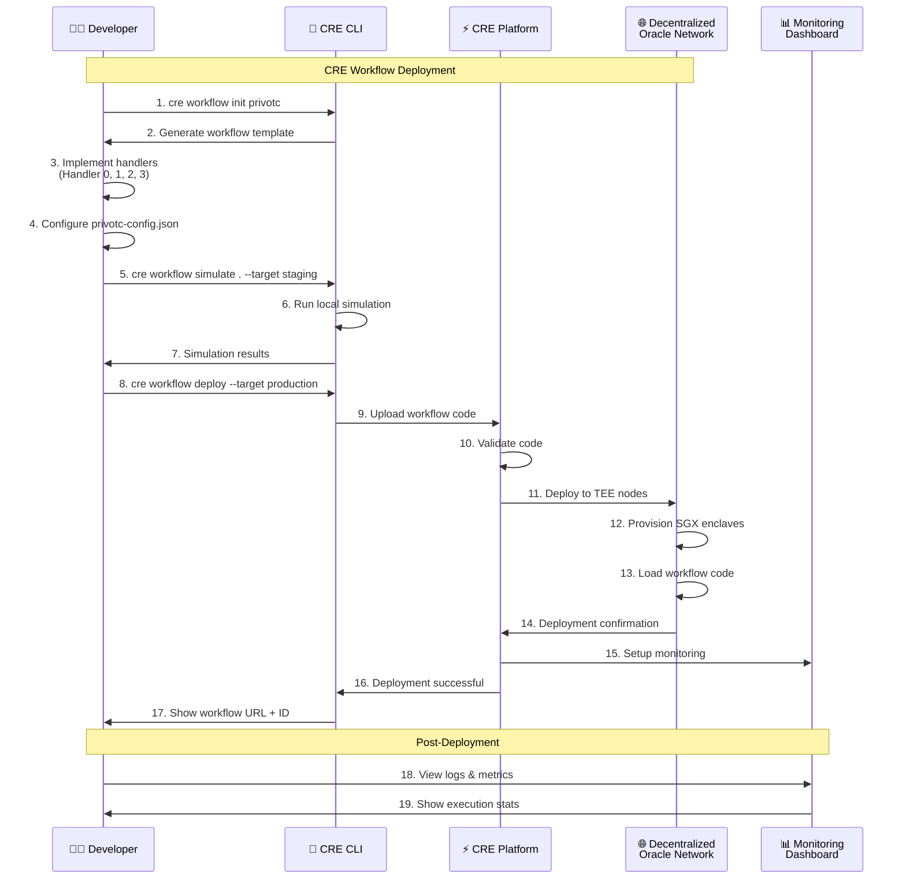

# PrivOTC Sequence Diagram

This document provides comprehensive sequence diagrams for the PrivOTC platform, focusing on the Chainlink CRE workflow and overall system architecture.

## Table of Contents
1. [Complete End-to-End Flow](#complete-end-to-end-flow)
2. [CRE Workflow Details](#cre-workflow-details)
3. [ZK Proof Generation](#zk-proof-generation)
4. [Settlement Flow](#settlement-flow)

---

## Complete End-to-End Flow

### Full Trading Flow: World ID → ZK Proof → CRE Matching → Settlement

---

## CRE Workflow Details

### CRE Handlers Architecture

---

## ZK Proof Generation

### ZK Balance Proof Circuit Flow

### ZK Proof Verification in CRE

---

## Settlement Flow

### Atomic Settlement with Escrow

### Settlement Security Mechanisms

---

## System Architecture Overview

### Complete System Map

---

## Performance & Security Notes

### Timing Benchmarks

| Operation | Time | Environment |
|-----------|------|-------------|
| World ID verification | ~2-5s | User device + API |
| ZK witness generation | ~200ms | Client-side (browser) |
| ZK proof generation | ~500ms | Client-side (browser) |
| ZK proof verification | ~50ms | CRE (TEE) |
| On-chain ZK verification | ~300k gas (~$15) | Smart contract (avoided!) |
| CRE matching execution | ~100-200ms | TEE |
| Escrow deposit tx | ~15s | Blockchain confirmation |
| Settlement execution | ~15s | Blockchain confirmation |

### Security Layers

1. **Sybil Resistance**: World ID (one trade per human)
2. **Privacy**: ZK proofs (balance hidden) + CRE TEE (matching hidden)
3. **Atomic Settlement**: All-or-nothing escrow swaps
4. **Proof Uniqueness**: nullifier_hash prevents replay attacks
5. **Time-bound Proofs**: ZK proofs expire after 5 minutes

---

## Integration Points

### Frontend → CRE
- **Endpoint**: POST `/api/trade`
- **Authentication**: World ID proof + ZK proof
- **Response**: Trade ID + status

### CRE → Smart Contracts
- **Method**: `executeSettlement(matchId, buyer, seller, amount)`
- **Gas Limit**: ~300k gas
- **Success Event**: `TradeSettled`

### CRE → Frontend
- **Endpoint**: POST `/api/matches`
- **Payload**: Match details for notification
- **WebSocket**: Real-time updates to users

---

## Error Handling

---

## Deployment Workflow

---

## References

- **CRE Documentation**: https://docs.chain.link/cre
- **World ID Docs**: https://docs.worldcoin.org/id
- **Circom Documentation**: https://docs.circom.io
- **snarkjs Guide**: https://github.com/iden3/snarkjs

---

*Last Updated: March 8, 2026*
*Project: PrivOTC - Privacy-Preserving OTC Trading*
*Tech Stack: World ID + Chainlink CRE + ZK-SNARKs + Tenderly*
